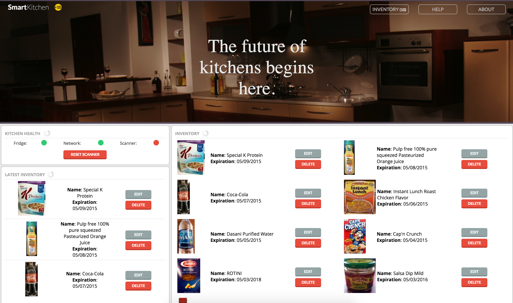
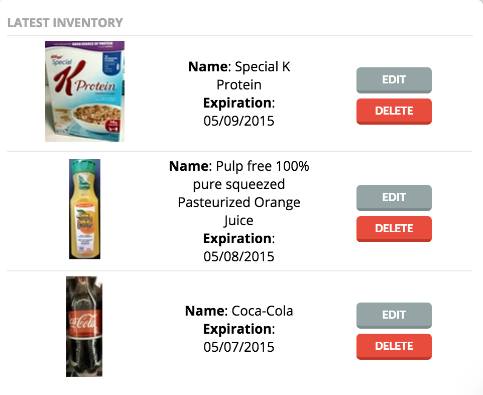

# SmartKitchen
A Kitchen application made to make remembering what is in your kitchen simpler. No more remembering whether or not you need to buy
milk or if the milk expired. You can scan the barcode on your milk, when you bought it, set the inventory using the simple web application,
and open the application at the grocery store to know if you need milk or not.

# Contributors
Harrison Kelly, Brian Day, AjayKumar Sarikonda

# Demo
https://www.youtube.com/watch?v=LZN7rU4Pwio

# Screenshots

# Progress (Week 3/28)

* Harrison Kelly
    * Fixed a UI caching issue and stubbed out the async calls for the new REST api. Also
    made a slight modification to the REST api and connected the /getLatestInventory/ call.
    * Got rid of the unused icons and changed the ordering of the Latest Inventory so that
    it was actually the latest and not the first three items, also changed the ordering of the Inventory
    to show the latest at the top.
    * Made the REST API pep8 compliant.
    * Added localization support to the REST api to make it simpler to change languages.
    * Added utility methods for the REST api to keep the file clean.
    * Wrote the "addInventory" REST call.
    * Turned on refreshing on the UI and made sure that it worked with the "addInventory" REST call, also connected
    other calls and enabled "deleting" (when the REST call is completed).
    * Connected the three different health status REST calls.
    * Added localized i18n messages and support for: English, French, and Spanish.
    * Fixed issue with alerts circle not being clickable.
    * Added a popup for editing the inventory items (not fully implemented) and began working on the styling for the main
    inventory container.
    * Added a default "expiration date" when an item is added to the inventory so that it isn't blank by default. Also fixed
    a reload issue where there were duplicates and ng-repeat did not like it.

* Brian Day
    * Started from scratch on scanner part of project it is now correctly threaded. Using zbarimg directly now
    and piping its output into our code. Scanner is also connected to the rest api, scanner health POST's to the
    rest api for now, may change
    * Scanner more flushed out, processes and threads die correctly when exited

* Ajay
    * Got api calls from Harrison and started working on the api and wrote getInventory.

# Progress (Week 4/04)

* Harrison Kelly
    * Fixed an issue of CORS not allowing us to make a rest call from :8000 to :5000.
    * Fixed an issue of Safari not liking the use of "const" and wouldn't display the page.
    * Fixed an issue where the inventory controller was being loaded multiple times.
    * Added missing function comments and alerts.
    * Updated cached items with possibly new expiration dates.
    * Connected the "edit" button with a popup that allows users to change the expiration date. The REST call is connected, just
    waiting for it to be written.
    * Fixed the latest refresh date to show the actual refresh date/time.
    * Changed the size of the banner so that it doesn't take up as much space.
    * Added a missing alert message when a REST call failed.

* Brian Day
    * rewrote all api calls to make more concise
    * completed delete item and set expiration functionality
    * working on a way to allow hardware to go into a low power mode

# Progress (Week 4/11)

* Harrison Kelly
    * Updated the UI to use the new version of the REST api and fixed the delete REST call.
    * Added a busy indicator.
    * Fixed an issue with editing expiration
    * Combined the latest inventory and inventory methods and added refresh spinners for the panels.
    * Added in UUIDs for each item on the server side.
    * Added in UUIDs to the client side, just need to connect them to the REST calls.
    * Finished modifying all of the REST calls on the server side.
    * Cleaned up code.

* Brian Day
    * Fixed issue with scannerhealth looking at network health
    * Fixed minor issue in restServices, setexpiration had trailing / in rest call
    * Fixed minor issue in healthcontroller, healthstatus was being used to display scannerstatus
    * Power-save feature turns off device if no use for X amount of time while still remains on enough to get calls from restapi/ui
    * working on connecting up ui control of turning pi back on and motion sensor to trigger turnon

* Ajay goud
    * began adding file lock to the rest api
    * need to fix a bug in filelock as it is releasing the file after certain time.
    * working on the file lock.

# Progress (Week 4/18)

* Harrison Kelly
    * Bug fixes
        * Fixed bug where the scanner health was actually a different health.
        * Fixed bug where multiple alerts with the same message were being added.
        * Fixed bug where refreshData was refreshing the data before the previous refresh(es) came back.
        * Fixed bug where setting the refresh date without changing it would increment the day by one.
        * Fixed bug where items without a uuid were created.
        * Fixed bug where the barcode was still being cached.
        * Fixed bug from adding the Item objects.
    * Added a way to restart the scanner.
    * Added an Item object instead of using an anonymous JSON object.
    * Added an Alert object instead of using an anonymous JSON object.
    * Added file locking to the REST api.
    * Added support for items where the barcode doesn't exist. This involved adding the ability to change
    the name of an item in the inventory.
    * Added a TOKEN based authentication to the REST api using PHP. The actual token is hidden in the PHP (can't be seen by view source), is
    hashed, and then injected into the javascript. The token is also hashed on the server side and validated before any REST call is made.

* Brian Day
    * installed raspberry pi in final case
    * MAJOR rewrite of scanner code
        * clean up of code
        * exception handling
        * better use of multiprocessing
        * method of how to do an ECO mode
            * created timer class to allow timeout functionality
            * using events to cause threads to suspend
    * Created and tested api calls for power saving mode